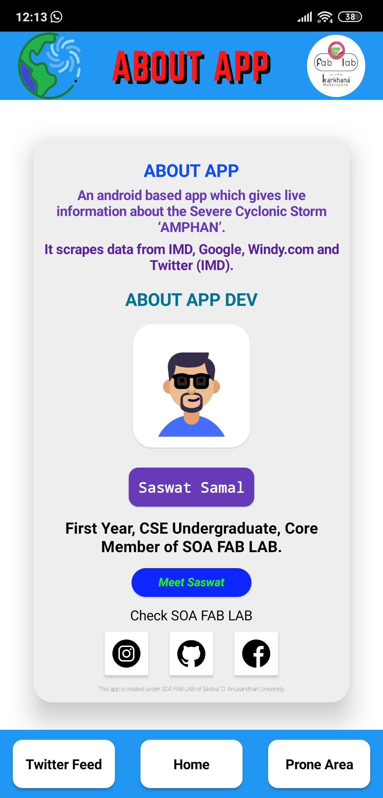

# ⛈ TrackAmphan ⛈ `v1.1.0`

An Android based web-app which gives live information about the Severe Cyclonic Storm ‘AMPHAN’.

*DOWNLOAD THE APP*: Check releases to download the latest version of app.

## About App

- Live cyclone map giving information about the eye of the cyclone, speed variations, and direction. (Thanks to windy.com for the live map)
- Live update on the areas which are prone to get affected by Amphan. (Thanks to maps.google.com and IMD)
- Live Twitter feed of IMD giving every detail of Amphan and it's news.

## Features

- Supports in every Android Device. 📱
- Live Updates on cyclone by IMD.🌪
- Live Map 🗺️ 
- Twitter Feed. 📟 
- Lite and consumes less space. 🚀
- Eyecatching UI. 📲

### Screenshots
   

#### Layout Details

